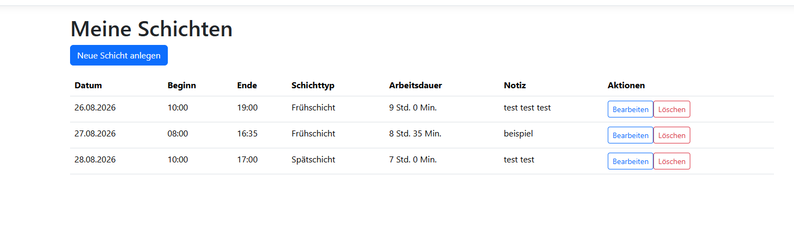

# Shift Planner

Eine ASP.NET-Core-Webanwendung zur Verwaltung persönlicher
Arbeitsschichten.

## Vorschau



## Motivation

Durch meine Berufserfahrung im öffentlichen Nahverkehr kenne ich die
Herausforderungen wechselnder Arbeitszeiten. Dieses Projekt entsteht
im Rahmen meiner Umschulung zur Fachinformatikerin für
Anwendungsentwicklung.

## Funktionen

- Arbeitsschichten anlegen
- Datum, Beginn und Ende erfassen
- Schichttyp auswählen
- optionale Notizen speichern
- Schichten chronologisch anzeigen
- vorhandene Schichten bearbeiten
- Schichten mit Sicherheitsabfrage löschen
- Arbeitsdauer automatisch berechnen
- Nachtschichten über Mitternacht berücksichtigen
- dauerhafte Speicherung in einer SQLite-Datenbank
- Formulareingaben validieren

## Technologien

- C#
- .NET 10
- ASP.NET Core MVC
- Entity Framework Core
- SQLite
- Razor
- HTML
- Bootstrap
- Git und GitHub
- xUnit
	

## Projekt lokal starten

Voraussetzung ist das .NET 10 SDK.

```bash
git clone DEINE-REPOSITORY-ADRESSE
cd ShiftPlaner/ShiftPlaner
dotnet restore
dotnet ef database update
dotnet run
```

## Tests ausführen

Die Arbeitszeitberechnung wird durch automatisierte Tests für normale Tagesschichten und Nachschichten über Mitternacht gesprüft.

```bash
dotnet test
```	